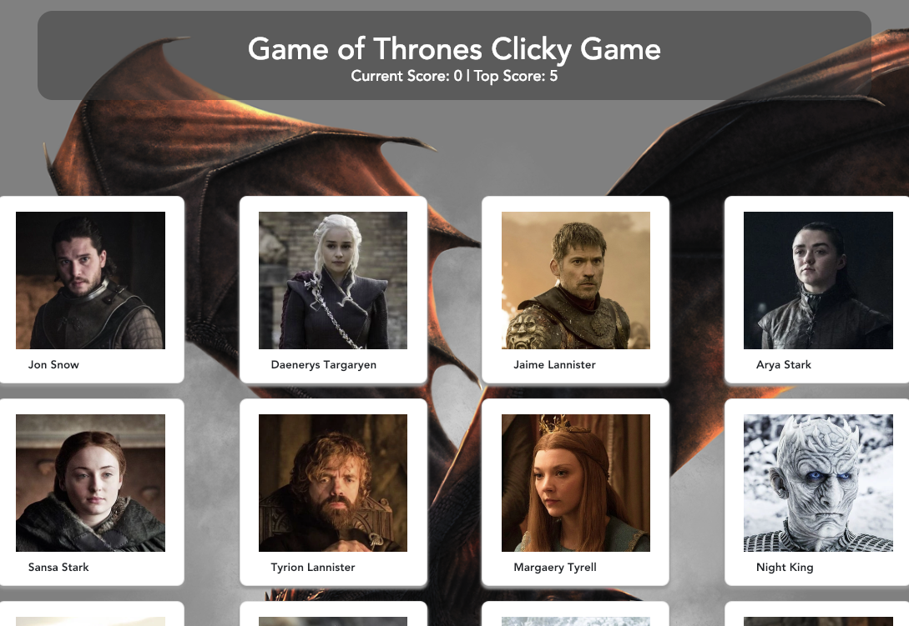

# Game of ThronesClicky Game

## Overview

For this assignment, I created a memory game with React. This is a simple matching game. The player should click one of the 12 Game of Throne images to get a point, and the images will refresh, and reorder the images. Player guesses again and if the selection has not been selected yet, another point will be awarded. If the player selects an image that was already picked, they lose the game and it resets. 

The application's UI is broken into 2 components. ONe for the title and one for the body where the game resides. 

The Technologies used invlude react, ES6, Bootstrap and CSS. 

